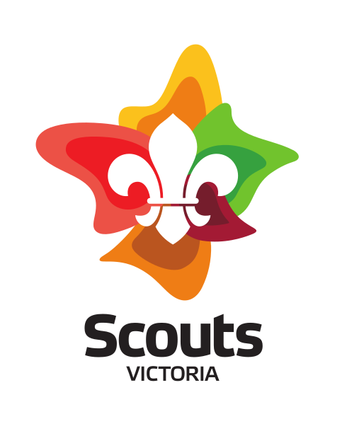
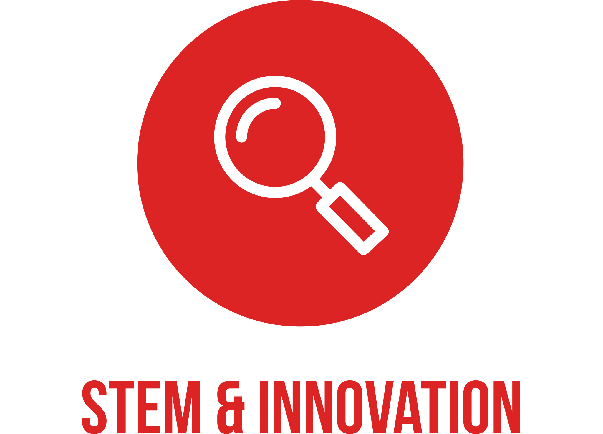
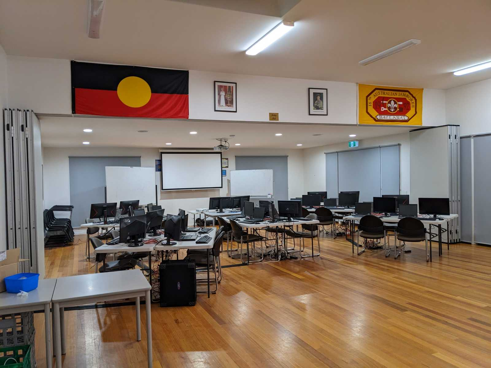
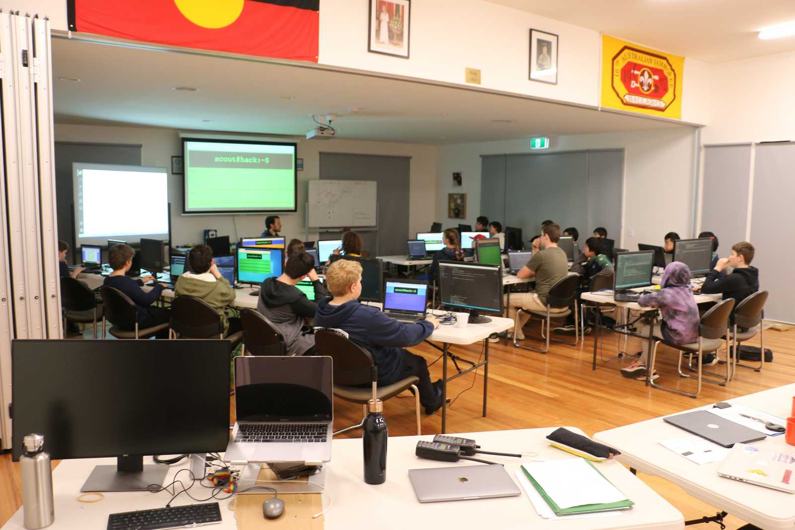
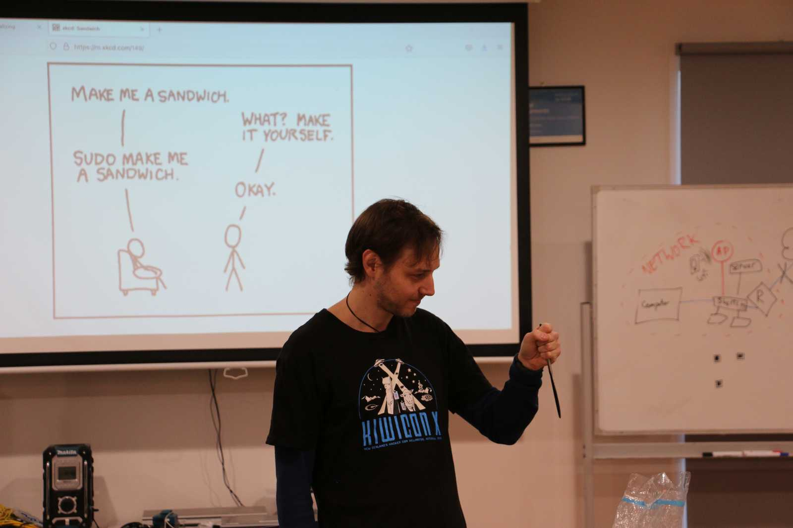
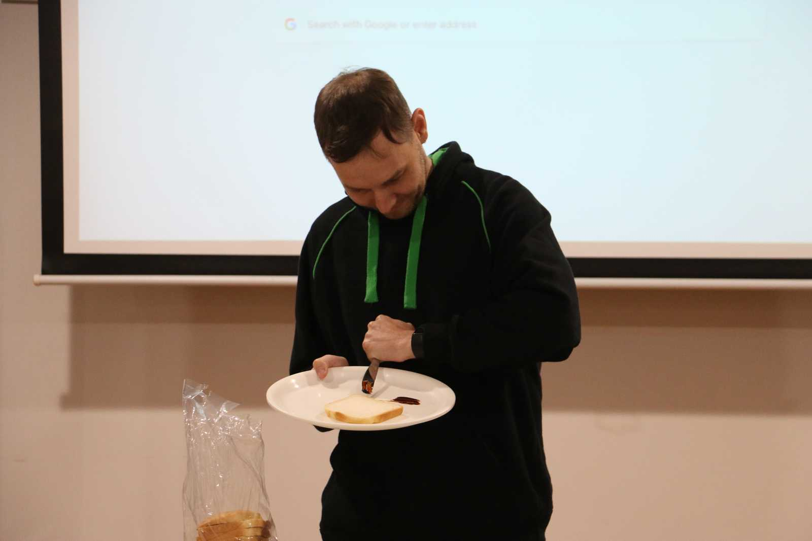
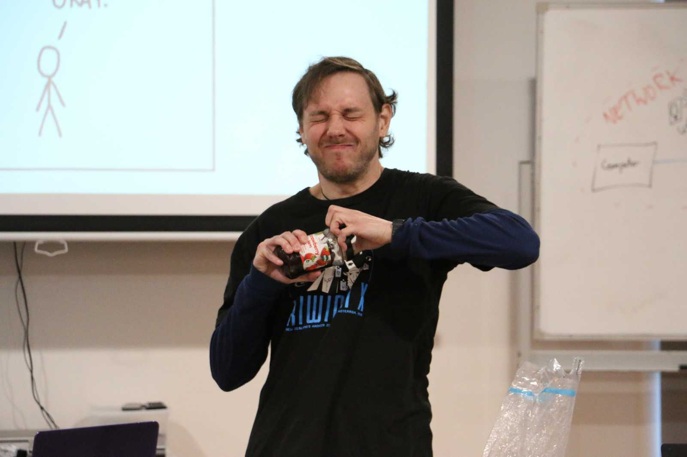
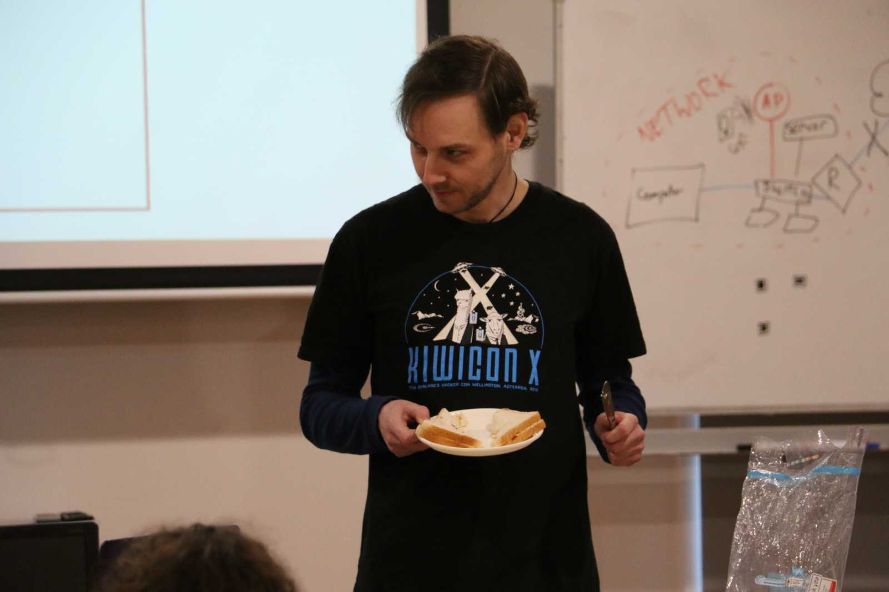

## Developing Labs for Teaching Kids Webdev

Matt Cengia
(they/them)

[blog.mattcen.com](https://blog.mattcen.com)

<!--
- Email: mattcen@mattcen.com
- Mastodon: [@mattcen@aus.social](https://aus.social/@mattcen)
- Matrix: [@mattcen:mattcen.com](https://matrix.to/#/@mattcen:mattcen.com)
- Website: [blog.mattcen.com](https://blog.mattcen.com)
- Slides: https://github.com/mattcen/2023-07-teach-kids-webdev
-->

License: [CC-BY-SA 4.0](https://creativecommons.org/licenses/by-sa/4.0/)

Note:

- I'm Matt (they/them)
- Find me by handle, M A T T C E N
- Post about talk using #FOSSY and #TeachKidsWebDev
- Slides available on GitHub: https://github.com/mattcen/2023-07-teach-kids-webdev

---

## Slides

[](https://github.com/mattcen/2023-07-teach-kids-webdev)

---

## Acknowledgements

Note:

I'm delivering this presentation on the unceded ancenstral lands of many Indigenous peoples.
I honour the knowledge, stewardship, and care with which they've tended this land throughout history, and recognise the deep and lasting damage that colonisation has inflicted on them.
I pledge to do my best to respect, learn from, and support these peoples. We can all do better.

---

## Proprietary software statement

* Presenting on a macOS laptop (using FOSS slide tools)
* Slides hosted on GitHub
* Some proprietary VS Code extensions

Note:

* Slide tool is reveal.js
* Proprietary VS code extensions are [Remote - SSH](https://marketplace.visualstudio.com/items?itemName=ms-vscode-remote.remote-ssh) and its dependencies. More details on their [GitHub page](https://github.com/Microsoft/vscode-remote-release) and in their [FAQ](https://code.visualstudio.com/docs/remote/faq#_why-arent-the-remote-development-extensions-or-their-components-open-source)
* Appear to be open source alternatives to these VS Code extensions, but I've not tested them properly yet

---

## My experience

- Scout Leader
- Perpetual volunteer
- Linux sysadmin and developer

Note:

- Scout leader and Linux sysadmin/dev since 2008
- Love teaching youth
- Enjoy solving problems and developing systems

---

## Talk Overview

- My Scouting History
- Course Inception
- Course Objectives
- Logistics
- Server-side tech details
- Client-side tech details
- Course recount
- Lessons learned

Combination of story time and technical details

Note:

- https://github.com/mattcen/dockerlab
- (private) https://github.com/Scouts-Victoria-Program/scouthack
- (private) https://github.com/Scouts-Victoria-Program/scouthack_flask_2023/commits/main or https://git.mattcen.com/mattcen/scouthack_flask/commits/branch/main
  Start commit: https://github.com/Scouts-Victoria-Program/scouthack_flask_2023/commit/4d87000 or https://git.mattcen.com/mattcen/scouthack_flask/commit/4d87000

---

# What is scouts?



Note:

- I'm a Scout Leader in Australia
- some folks think of "boy scouts" [camping/hiking/constructing things with wood and rope](https://en.wikipedia.org/wiki/Scouting_for_Boys), or "girl scouts" and their cookies
- Scouts Australia is inclusive to all genders etc., welcomes youth from 5-26 years, all adults
- Not just outdoor stuff anymore
- Anything the scouts want; [Youth Leading, Adults Supporting](images/YA.svg)
- Scouts Australia has an updated award scheme to recognise youth achievement
- Broader, less prescriptive
- One of six new "Special Interest Areas" is "[STEM & Innovation](images/SI.svg)"; includes IT

<!---->

----

<!-- .slide: data-background-color="blue" -->

# My history in scouting

Note:

- Been involved since I was 8
- Besides outdoor skills, also life skills:
	- plan a healthy menu
	- shopping list
	- cook
	-	budget
	- pack for multi-day camp
	- pack/tie down trailer
	- lead peers without direct adult oversight
- Took break at 18 for university
- 3 years later, was staring at screens for work, study, play
- needed escape
- became scout leader in 2008, with 11- to 15-year-olds
- since been leader of adults (training other leaders)
- also activity leader (facilitating state-wide events for scouts of all ages)

----

<!-- .slide: data-background-color="blue" -->

# Full-circle

Note:

- Increasingly found myself staring at screen for scout work
- Recently been using IT skills for scouts
- open data/software to make topo maps
- build/admin websites with Python/Django
- fellow leaders are IT folk, but much work fell to me
- also, we wouldn't be around forever, so needed to succession plan

---

# ScoutHack inception


Note:

- Leverage Youth Leading, Adults Supporting
- Hand down to youth
- Teach youth about IT
- Give them agency to decide our direction
- @ekulbyrnes suggested we run tech camp to teach basic webdev and maybe ops/sysadmin
- Inspiration from GovHack - hackathon we ran together
- Coined "ScoutHack", decided on 2-day camp
- Began weekly planning via Jitsi

----

# Syllabus

Note:

- HTML
- CSS
- Intro to some server-side scripting
- Ambitious for a weekend
- 11+-year-olds of varying competence
- Decided even they don't need to retain all the details
- Just walking through step-by-step gives a taste
- They can pursue in future, individually or at potential "ScoutHack 2.0"

----

# Event logistics

Note:

- Goals set; what resources do we need?
- To optimise accessibility, don't require BYO computer
- Having our own PC fleet ensures homogeneity, rather than dealing with different OSes etc
- Andy had a fleet of Toshiba Tecra M10 laptops
- From 2011; older than many of the scouts
- Install Linux, lightweight DE; sufficiently capable
- Only need web browser and text editor/IDE
- Also managed to scrounge enough external keyboards, mice, and VGA monitors for second screen

----



Note:

Classroom space with 2 projector screens, and around 20 desks with laptops and peripherals

- Next problem: power for old inefficient monitors, despite being LCD
- Managed to book recently-built activity centre at scout camp
- Self-contained:
	- bunk beds
	- kitchen
	- bathrooms
	- large space for dining/classroom
	- new electrical wiring!
- Spread across several electrical circuits, managed to avoid tripping circuit-breakers!

----

# Location challenges

Note:

- Campsite was out in the sticks, so no internet, poor cell coverage
- How do we teach web dev without internet?
- Run local server
- Could have kids run server on localhost
- Wanted to give feeling of hosting where others could access
- Devised bigger plans

---

# Technical details

----

# Server-side tech details

Note:

- Found old rack-mount server
- Some switches
- Many network cables
- Decided to give scouts a full "VPS". Allow:
	- Running webserver
	- Installing packages
	- Storing files
- Each scout got:
	- Ubuntu Docker container
	- SSH server
	- Standard user account
	- full `sudo` access
- Did this with:
	- sshpiper
		- reverse proxy gor SSH
		- person-in-the-middle SSH
		- routes connections to containers based on username or SSH key
	- Traefik
		- reverse HTTP proxy
		- local DNS with `*.scouthack` pointing to server
		- Traefik routing `http://username.scouthack` to each container's port 80
- How do we teach SSH basics without going into great detail?

----

# Client-side tech details

Note:

- Laptops running Xubuntu (Ubuntu with XFCE)
- SSHd for remote admin
- Firefox
- VS Code
	- Remote SSH VS Code extension (closed-source; open alternative?)
- Used Clonezilla to image all other laptops via UDP multicast
- Less than an hour to image 20+ machines

---

# Course recount

----

# Getting students started

Note:

- Scouts arrive Friday evening
- We had them assemble their computer. Plug in:
	- Power
	- Monitor
	- Ethernet
	- Keyboard
	- Mouse
- Not hard, but likely new to some
- They naturally tried to get online, but no internet!
- "Why can't you get online?"
- "We're not on Wi-fi"
- Used this as a teaching opportunity. Distinguished between:
	- Wi-fi
	- LAN (over Ethernet)
	- Internet
- No internet, *but* have server they can host their websites on

----



Note:

Previous classroom full of scouts mid-session

----

# Evening down-time

Note:

- Getting late in evening, so called it a night
- I set up a Minetest server for them to join
- Interesting Network Effects side-bar:
	- One scout had their own laptop the first year
	- Had Minecraft(TM), and felt superiour
	- Until realising they were playing alone
	- Quickly asked if we could install Minetest for them to join the other scouts

---

# Make me a sandwich


(CC BY-NC 2.5 Randal Munroe)

Note:

- Next morning, after breakfast
- Asked scouts what computers do/how they work
- I have an oft-frustrating literal-mindedness
- Luke decided to leverage it:
- Have the scouts instruct me to make a sandwich

----



Note:

Matt holding a knife in a scary stabbing motion

- Given:
	- Loaf of bread in a plastic bag
	- Tub of butter
	- Vegemite/jam
	- Knife
	- Plate
- Deliberately misinterpred instructions
- Followed to letter
- Demonstrated the value of precision
- Hilarious results

----



Note:

Matt failing to spread Vegemite on bread while holding knife backwards

----



Note:

Matt trying to pull a twist-top lid off a jam jar

----



Note:

Matt holding a completed sandwich

---

# VS Code set-up

Note:

Instructed scouts with more detailed version of:

1. Open VS Code
2. Use the Remote SSH extension to connect to `username@username.scouthack`, and enter your password when prompted
3. Open the `code` folder we've pre-created for you
4. Create a file called `index.html`, and put some text in it, then save the file
5. Use <kbd>Ctrl</kbd>+<kbd>\`</kbd> to open a terminal
6. Type `python -m http.server 80` and press enter
7. Open Firefox, and browse to http://username.scouthack

- Whoa, we published a website!
- That other scouts could browse to!

----

<!-- .slide: data-background-color="blue" -->

# HTML

Note:

Covered basic HTML Tags:

1. Text ("hello world")
2. headings (`<h1>`-`<h6>`)
3. newlines (`<br>`)
4. bold (`<b>`, then `<strong>`)
5. italics (`<i>`, then `<em>`)
6. paragraphs (`<p>`)
7. images (`foo</img>`, then `foo</img>`, then ``)
8. New doc (`foo.html`)
9. links (`<a href="foo.html">foo</a>`)
10. lists (`<ol>`, `<ul>`)
12. tables (`<table><thead><tr><th>foo</th></tr></thead><tbody><tr><td>bar</td><td>quux</td></tr></tbody></table>`)

Broke for lunch, before preparing to teach CSS

----

<!-- .slide: data-background-color="blue" -->

# CSS

Note:

- We have basic HTML, let's style it
- Introduced CSS colo<del>u</del>rs
	- Some colours can be referred to by name
	- The rest need RGB (or HSL, which we didn't cover)
	- decimal or hexadecimal
- Add CSS to page so we can colour it:
	- inline style attributes first
	- then use \<style\> in \<head\>
- CSS selectors:
	- element type selectors
	- class selectors
	- id selectors
- CSS attributes: `color`, `background-color`, etc
- So garish!
- VS Code shows colour preview/picker on hover
- Move CSS to a `style.css` file

----

# Bootstrap

Note:

- Introduce Bootstrap
- Pre-build CSS classes
- Rapid styling
- Modern-looking; less '90s

Then, more Minetest!

----

# Server-side scripting

Note:

- Built a simple Python Flask web server
- Goal:
	- Submit "program ideas" for scout groups
	- List submitted "program ideas"
- Web form:
	- author: input box
	- idea: text area
- I synthesised a git repo:
- every commit was 1 step
- shell script loop through commits to show outcome
- show commit diff in forge

https://git.mattcen.com/mattcen/scouthack_flask/commits/branch/main

----

<!-- .slide: data-background-color="blue" -->

# Server-side scripting

Note:

The general process here was:
1. Create and activate a Python `venv`
2. `pip install flask`
3. Create a basic `website.py` file (8 lines of code) and make it executable with `chmod +x`
4. Move existing `index.html` to a `templates/` folder where Flask can find it
5. Run `./website.py`
6. Browse to http://username.scouthack to see existing web page, albeit without other resources (images, CSS etc)
7. Move other static assets into a `static/` folder for Flask, and update references in HTML
8. Update HTML to template it with Jinja2
9. Add HTML form to submit programme idea
10. Write Python code to store form submission in a CSV file
11. Write code to parse CSV and show programme list as HTML

- Biggest challenge: typos
- Scouts had fun reading and adding to each others' programme lists

---
# Python code walk-through

----

<!-- .slide: data-auto-animate -->
```python []
#!/usr/bin/env python
from flask import Flask, render_template, request, redirect, url_for

app = Flask(__name__)


@app.route("/")
@app.route("/index.html")
def home():
    return render_template('index.html')


if __name__ == "__main__":
    app.run(debug=True, port=80, host="0.0.0.0")
```
<!-- .element: data-id="code-animation" -->

----

<!-- .slide: data-auto-animate -->
```python [10]
#!/usr/bin/env python
from flask import Flask, render_template, request, redirect, url_for

app = Flask(__name__)


@app.route("/")
@app.route("/index.html")
def home():
    return render_template('patrol.html')


if __name__ == "__main__":
    app.run(debug=True, port=80, host="0.0.0.0")
```
<!-- .element: data-id="code-animation" -->

----

<!-- .slide: data-visibility="hidden" -->
```python [13-15]
#!/usr/bin/env python
from flask import Flask, render_template, request, redirect, url_for

app = Flask(__name__)


@app.route("/")
@app.route("/index.html")
def home():
    return render_template('patrol.html')


@app.route('/hello/')
def hello():
    return render_template('hello.html')


if __name__ == "__main__":
    app.run(debug=True, port=80, host="0.0.0.0")
```
<!-- .element: data-id="code-animation" -->

----

<!-- .slide: data-visibility="hidden" -->
```python [14-16]
#!/usr/bin/env python
from flask import Flask, render_template, request, redirect, url_for

app = Flask(__name__)


@app.route("/")
@app.route("/index.html")
def home():
    return render_template('patrol.html')


@app.route('/hello/')
@app.route('/hello/<name>')
def hello(name=None):
    return render_template('hello.html', name=name)


if __name__ == "__main__":
    app.run(debug=True, port=80, host="0.0.0.0")
```
<!-- .element: data-id="code-animation" -->

----

<!-- .slide: data-auto-animate -->
```python [19-21]
#!/usr/bin/env python
from flask import Flask, render_template, request, redirect, url_for

app = Flask(__name__)


@app.route("/")
@app.route("/index.html")
def home():
    return render_template('patrol.html')


@app.route('/hello/')
@app.route('/hello/<name>')
def hello(name=None):
    return render_template('hello.html', name=name)


@app.route('/program/new', methods=['POST', 'GET'])
def new_program():
    return render_template('new_program.html')


if __name__ == "__main__":
    app.run(debug=True, port=80, host="0.0.0.0")
```
<!-- .element: data-id="code-animation" -->

----

<!-- .slide: data-auto-animate -->
```python [3,6-7|22-35]
#!/usr/bin/env python
from flask import Flask, render_template, request, redirect, url_for
import csv

app = Flask(__name__)
fieldnames = ['author', 'idea']
database = 'programs.csv'


@app.route("/")
@app.route("/index.html")
def home():
    return render_template('patrol.html')


@app.route('/hello/')
@app.route('/hello/<name>')
def hello(name=None):
    return render_template('hello.html', name=name)


@app.route('/program/new', methods=['POST', 'GET'])
def new_program():
    if request.method == 'POST':
        program = {
            'author': request.form['author'],
            'idea': request.form['idea']
        }
        with open(database, 'a') as csvfile:
            csvwriter = csv.DictWriter(csvfile, fieldnames=fieldnames)
            csvwriter.writerow(program)

        return redirect(url_for('new_program'))
    else:
        return render_template('new_program.html')


if __name__ == "__main__":
    app.run(debug=True, port=80, host="0.0.0.0")
```
<!-- .element: data-id="code-animation" -->

----

<!-- .slide: data-auto-animate -->
```python [22-33|47]
#!/usr/bin/env python
from flask import Flask, render_template, request, redirect, url_for
import csv

app = Flask(__name__)
fieldnames = ['author', 'idea']
database = 'programs.csv'


@app.route("/")
@app.route("/index.html")
def home():
    return render_template('patrol.html')


@app.route('/hello/')
@app.route('/hello/<name>')
def hello(name=None):
    return render_template('hello.html', name=name)


@app.route('/program')
def list_programs():
    programs = []
    try:
        with open(database) as csvfile:
            csvreader = csv.DictReader(csvfile, fieldnames=fieldnames)
            for row in csvreader:
                programs.append(row)
    except FileNotFoundError:
        pass

    return render_template('program.html', programs=programs)


@app.route('/program/new', methods=['POST', 'GET'])
def new_program():
    if request.method == 'POST':
        program = {
            'author': request.form['author'],
            'idea': request.form['idea']
        }
        with open(database, 'a') as csvfile:
            csvwriter = csv.DictWriter(csvfile, fieldnames=fieldnames)
            csvwriter.writerow(program)

        return redirect(url_for('list_programs'))
    else:
        return render_template('new_program.html')


if __name__ == "__main__":
    app.run(debug=True, port=80, host="0.0.0.0")
```
<!-- .element: data-id="code-animation" -->

----

# Wrapping up

Note:

- In remaining time, scouts tweaked websites as they wished
- Had them shut down and dissassemble computers
- Pack up their gear, prepare for home
- Promised to zip up their websites and send them to them after camp

---

# Lessons learned

Note:

- Typos
	- touch-screen users less used-to keyboard/mice
	- no biggie with HTML/CSS
	- Python less forgiving
	- Trivial syntax errors despite request to copy precisely and double-check
	- I diff'd scouts' code with mine server-side to speed through typos
	- Couldn't teach them to debug, but at least they got something that worked
	- Use Werkzeug debugger in future
- Winging coursework
	- Worked first couple of times
	- Reduce ongoing effort with tighter material
	- Couldn't re-use my Flask app from last time - scouts were starting from different files
	- Had to review websites during downtime to bring up to speed
	- More typos
	- Despite reviewing websites, scouts accidentally deleted large code blocks
	- Maybe give scouts fresh template at start of each session?
- Web-based editor
	- OpenVSCode Server
	- Jupyter Lab
	- VS Code is good because it's easy for scouts to set up at home

----

# Conclusion

- Very positive feedback from ScoutHack attendees/parents
- Several returning members
	- They worked on their own projects while we covered course material
	- Intend to offer "Webdev 2.0" (more Flask/FastAPI/Django) or "DevOps 1.0" (set up the VPS/web server)
	- Also red/blue/purple team infosec
- Looking forward to future courses

---


## Thanks

* Luke Byrnes ([@ekulbyrnes@infosec.exchange](https://infosec.exchange/@ekulbyrnes))
* [Pieper Cafe](http://www.piepercafe.com/) (SE Portland)
* [FOSSY](https://fossy.us)
* Andy King - Photos
